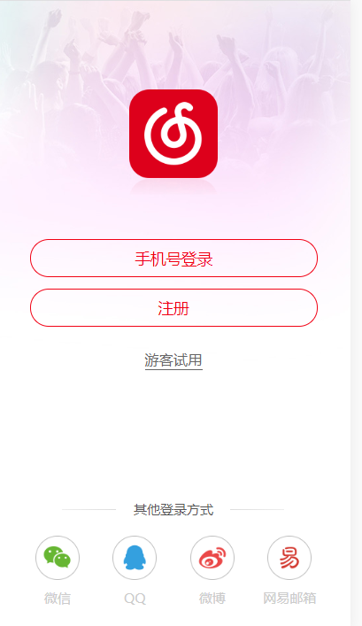
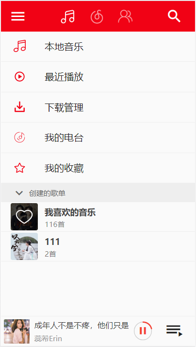
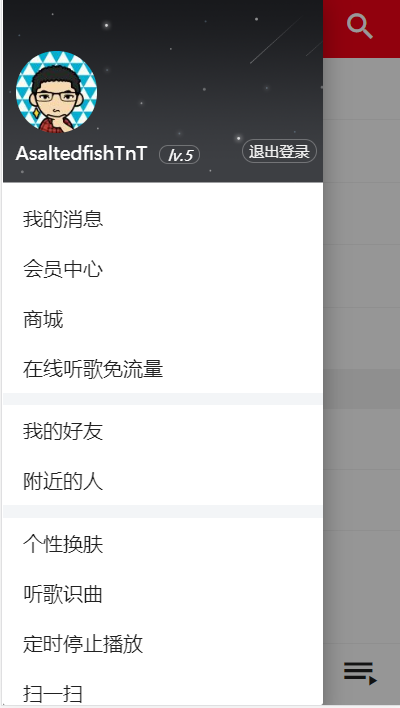
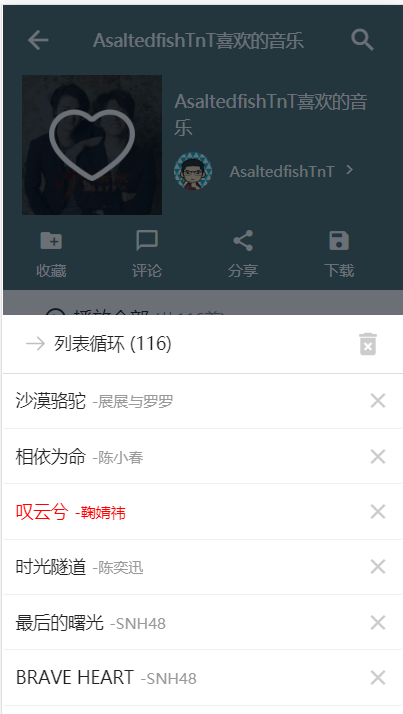
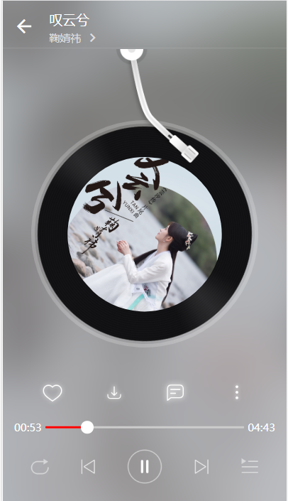
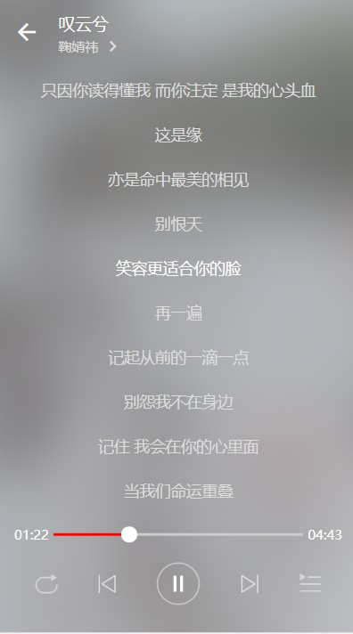

# wy-music

> 仿照网易云App所制作的一个vue项目。

##注意
```
1. 此项目的api依赖于node后台"https://binaryify.github.io/NeteaseCloudMusicApi/#/"，所以若要运行项目前，请先clone安装并且运行后台
2. 如若要运行项目，需要登录，登录的用户名密码为真实网易的用户名密码。
```
## 项目介绍

```
1. 使用了node后台提供的十多个api实现了十多个页面的效果并且实现的数据的交互。
2. 通过api实现了用户登录，获取歌单，音乐播放，视频播放，音乐控件，歌词滚动，轮播图，图片懒加载，上拉加载，下拉刷新等等的功能。
```
##安装并运行后台
```
$ git clone git@github.com:Binaryify/NeteaseCloudMusicApi.git
$ cd ./NeteaseCloudMusicApi
$ npm install
$ node app.js
```

## 运行项目
```
# install dependencies
npm install

# serve with hot reload at localhost:8080
npm run dev

# build for production with minification
npm run build

# build for production and view the bundle analyzer report
npm run build --report
```

For a detailed explanation on how things work, check out the [guide](http://vuejs-templates.github.io/webpack/) and [docs for vue-loader](http://vuejs.github.io/vue-loader).

## 项目效果图











